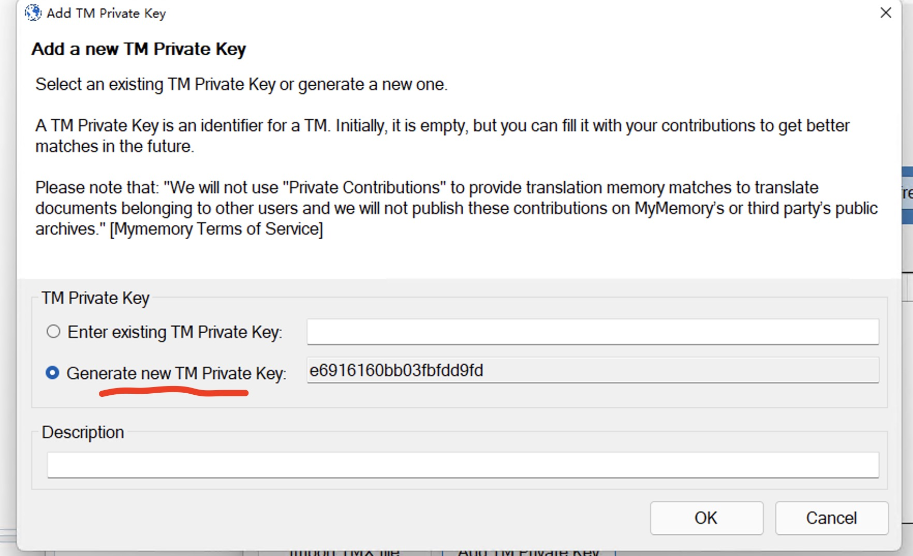

# 远程共享翻译记忆库

## 基本方法

[myMemory](https://mymemory.translated.net/) 是一个在线的翻译记忆库共享公平，通过插件既可以远程检索该库中的内容，同时也可以生成私有TM库，仅供小组协作使用。

## 步骤：

1. 注册myMemory账号
2. 下载 [Trados 的 myMemory](https://appstore.sdl-china.cn/cn/language/app/mymemory/337/) 插件
3. 安装该插件后，在翻译记忆库添加页面添加myMemory
4. 在配置页面由一个成员 ***Generate new TM Private Key***
5. 其他成员输入该Key后，即可实时共享该记忆库。

